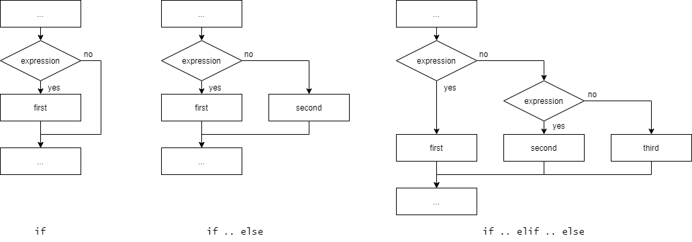

# Условия

## Синтаксис

```python
if expression:
    # some code
```

```python
if expression:
    # some code
else:
    # some code
```

```python
if expression:
    # some code
elif another_expression:
    # some code
else:
    # some code
```



## Операторы сравнения

- больше (>)
- меньше (<)
- больше или равно (>=)
- меньше или равно (<=)
- равно (==)
- не равно (!=)

Логическое выражение возвращает **True** (истина) или **False** (ложь).
