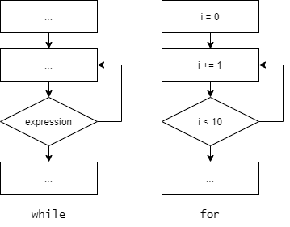

# Циклы

## while

Цикл `while` выполняется, пока условие истинно.

```python
while expression:
    # some code
```

## for

Цикл `for` применяется, когда количество повторений известно заранее.

Число повторений зависит от диапазона (`range`) или от количества элементов в итерируемом объекте (списке, кортеже и т.д.).

```python
for i in range(a, b):
    # some code
```

```python
for value in object:
    # some code
```



