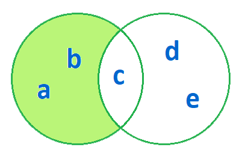
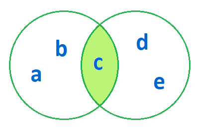
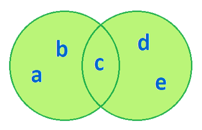

# Множества (sets)

Множество - неупорядоченный набор неповторяющихся элементов.

### Свойства множеств

- элементы не повторяются;
- элементы располагаются в случайном порядке;
- нельзя изменять значения элементов множества.

### Создание пустого множества

```python
>>> x = set()
>>> x
set()
```

### Создание множества со значениями

```python
>>> x = set('abcdefg')
>>> x
{'e', 'd', 'f', 'g', 'c', 'a', 'b'}
>>> x = {'a', 'b', 'c', 'd', 'e', 'f', 'g'}
>>> x
{'e', 'd', 'f', 'g', 'c', 'a', 'b'}
```

### Операции над множествами

- `a.update(b)` - объединение множеств
- `a.intersection_update(b)` - пересечение множеств
- `len(s)` - количество элементов в множестве
- `s.add(x)` - добавление элемента
- `s.remove(x)` - удаление элемента (если такого элемента нет, поднимается исключение **KeyError**)
- `s.discard(x)` - удаление элемента (без поднятия исключения)

### Разность множеств

```python
>>> a = {'a', 'b', 'c'}
>>> b = {'c', 'd', 'e'}
>>> a.difference_update(b)
>>> a
{'a', 'b'}
```



### Пересечение множеств

```python
>>> a = {'a', 'b', 'c'}
>>> b = {'c', 'd', 'e'}
>>> a.intersection_update(b)
>>> a
{'c'}
```



### Объединение множеств

```python
>>> a = {'a', 'b', 'c'}
>>> b = {'c', 'd', 'e'}
>>> a.update(b)
>>> a
{'e', 'd', 'c', 'a', 'b'}
```



