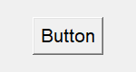
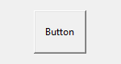

# Кнопка (Button)

```python
self.button = Button(text='Button')
self.button.pack()
```


Свойства:

- **text** - надпись

- **width** - ширина (количество символов, которое помещается в кнопку)

- **height** - высота (количество строк, которое помещается в кнопку)

- **background (bg)** - цвет фона

- **foreground (bg)** - цвет текста

- **activebackground** - цвет фона активной (нажатой) кнопки

- **activeforeground** - цвет фона активной (нажатой) кнопки

- **font** - шрифт

- **bd** - толщина траницы

- **relief** - вид границы

- **padx, pady** - отступы от границ до текста кнопки

- **command** - функция, вызываемая при нажатии на кнопку

| width=5               | height=5              | width=5, height=5      |
| --------------------- | --------------------- | ---------------------- |
|  |  |   |
| **bg='yellow'**       | **fg='blue'**         | **font='Arial 28'**    |
|  |  |   |
| **bd=5**              | **relief=FLAT**       | **padx=10, pady=15**   |
|  |  |  |


