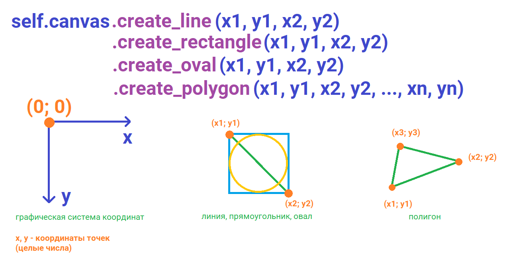

# Область рисования (Canvas)

```python
self.canvas = Canvas()
self.canvas.pack()
```

Свойства:

- **bg** - цвет фона

- **width** - ширина

- **height** - высота

Функции рисования:

```python
self.canvas.create_line(x1, y1, x2, y2) # линия
self.canvas.create_rectangle(x1, y1, x2, y2) # прямоугольник, квадрат
self.canvas.create_oval(x1, y1, x2, y2) # овал, круг
self.canvas.create_polygon(x1, y1, x2, y2, ..., xn, yn) # полигон
```



Параметры функций рисования:

- **fill** - цвет заливки

- **outline** - цвет обводки

- **width** - толщина линии


