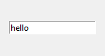
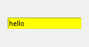
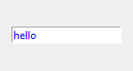
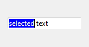
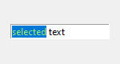
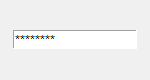
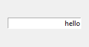
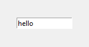
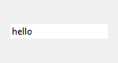

# Текстовое поле (Entry)

Текстовое поле позволяет вводить однострочный текст.

```python
self.entry = Entry()
self.entry.pack()
```



Свойства:

- **bd** - толщина границы

- **relief** - тип границы

- **width** - ширина (количество символов, которое помещается в поле)

- **justify** - выравнивание текста (LEFT - по левому краю, CENTER - по центру, RIGHT - по правому краю)

- **background (bg)** - цвет фона

- **foreground (bg)** - цвет текста

- **selectbackground** - цвет фона при выделении

- **selectforeground** - цвет текста при выделении

- **font** - шрифт

- **show** - маска (например, для ввода пароля)

Методы:

- `insert(pos, text)` - вставляет значение `text` на позицию `pos` (END - конец строки)

- `delete(start, end)` - удаляет текст от позиции `start`до `end`

- `get()` - возвращает текст, введённый в поле

| bg='yellow'                 | fg='blue'                    | font='Arial 12'       |
| --------------------------- | ---------------------------- | --------------------- |
|         |          |   |
| **selectbackground='blue'** | **selectforeground='green'** | **show='*'**          |
|         |          |   |
| **justify=RIGHT**           | **bd=1, width=15**           | **relief=FLAT**       |
|         |          |  |


