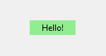

# Текстовая метка (Label)

Свойства:

- **text** - надпись

- **background (bg)** - цвет фона

- **foreground (bg)** - цвет текста

- **font** - шрифт

- **justify** - выравнивание текста (LEFT - по левому краю, CENTER - по центру, RIGHT - по правому краю)

- **anchor** - положение текста внутри метки

- **bd** - толщина траницы

- **relief** - вид границы

- **padx, pady** - отступы от границ до текста

| bg='white'           | fg='magenta'                              | font='Arial 14 bold'         |
| -------------------- | ----------------------------------------- | ---------------------------- |
|  |                       |          |
| **justify=CENTER**   | **anchor='se', height=7, bg='lightblue'** | **bd=1, relief=RAISED**      |
|  |                       |          |
| **relief=SUNKEN**    | **bg='lightgreen', padx=15**              | **bg='lightgreen', pady=25** |
|  |                       |         |

